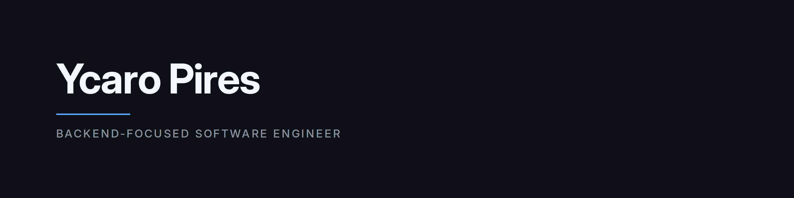

  

  <a href="mailto:ycaro.oleg.job@gmail.com">Email</a>
  &nbsp;·&nbsp;
  <a href="https://www.linkedin.com/in/ycaro-pires-944297240/">LinkedIn</a>
  &nbsp;·&nbsp;
  <a href="https://x.com/Ycaro_Oleg">X</a>
  &nbsp;·&nbsp;
  <a href="https://ycaro-oleg.github.io/">Portfolio</a>
  &nbsp;·&nbsp;
  <a href="https://kaerus.dev">Kaerus</a>

---

### About

Backend-focused Software Engineer with 4+ years shipping high-availability Ruby on Rails systems in production. I've led integrations adopted across multiple government institutions in Brazil and I like wiring AI APIs into real workflows.

Based in Fortaleza, Brazil · open to remote & relocation — US / EU

**Currently:** Mid-level Software Engineer @ Coreplan — leading a mission-critical judicial-integration platform (REST/Bearer auth, async job processing, PDF generation) live across 4+ State Attorney General offices.

**Building:** [Kaerus](https://kaerus.dev) — a clinic that measures whether engineers can still debug with the assistant closed.

### Stack

**Backend** — Ruby, Ruby on Rails, PostgreSQL, Sidekiq / Resque, REST APIs, JWT Auth
**Frontend** — React, Next.js, TypeScript, JavaScript
**Practices** — CI/CD, OOP & SOLID, Automated testing (RSpec), AI API integration (OpenAI / Azure)

### What I'm working on

**[Kaerus](https://kaerus.dev)** — Debugging clinic that measures unaided skill. Drills and incident-pressure simulations run with the assistant turned off on purpose: the next outage will take that measurement either way, so the product takes it first. A simulated Linux host is a pure world-model — nothing is executed — so every engineer on a team gets a byte-identical incident and the report records what was observed, not how clever the write-up sounded. Sandboxed graders score Ruby / JS / Python / Go. The dashboard flags atrophy from graded attempts before Friday's page does. Source is private; the product is live at [kaerus.dev](https://kaerus.dev).

**[SlackBot-SynergyRails](https://github.com/Ycaro-Oleg/SlackBot-SynergyRails)** — AI Slack assistant with per-thread conversation memory. Rails 8 API, JWT-secured admin surface, Sidekiq jobs, a hand-rolled OpenAI streaming client, and full CI (Rubocop, Brakeman, RSpec). Milestone 3 of 4.

**[SynergyCards](https://github.com/Ycaro-Oleg/SynergyCards)** — Real-time Kanban that moves cards when GitHub PRs open, merge, or close. HMAC-verified webhooks, fractional indexing, optimistic locking, an append-only event log, ActionCable + Turbo Streams.

**[Tetris](https://github.com/Ycaro-Oleg/omarchy-my-tetris)** — Terminal Tetris for Omarchy that follows the active theme. Classic / Sprint / Ultra, three Korobeiniki arrangements, installable as a bar plugin.
